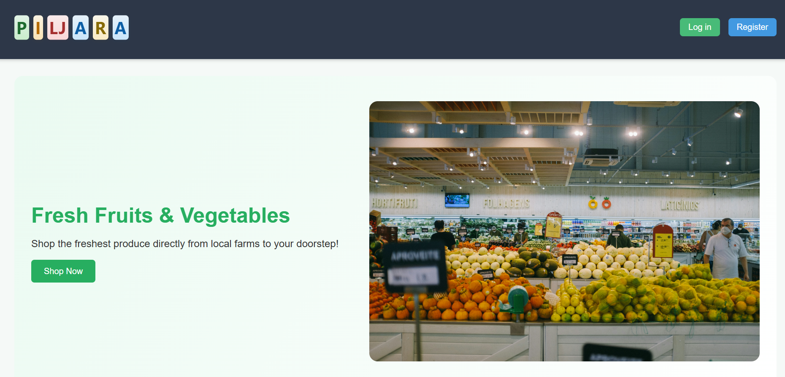

# 🛒 Piljara — Full-Stack Web App (Node.js + MongoDB + EJS)

**Piljara** is a modern web application for an online fruit and vegetable store.  
Users can browse products, filter them by category, add them to a cart, and place an order.  
Administrators can manage products and users through a secure dashboard.

---

## 🚀 Tech Stack

- **Backend:** Node.js, Express.js  
- **Frontend:** EJS Templates, Vanilla JS, CSS  
- **Database:** MongoDB + Mongoose  
- **Authentication:** Session-based login  
- **Image Upload:** Cloudinary API  
- **Middleware:** express-session, method-override, bcrypt  

---

## 🧩 Core Features

### 👤 User
- Register and log in  
- Browse all available products  
- Filter by category  
- Add products to cart (measured in kilograms)  
- View the cart in a **modal**, without page reload  
- Responsive design  

### 🛠️ Admin
- Access **Admin Dashboard**  
- Add, edit, and delete products  
- Upload product images directly to **Cloudinary**  
- Manage registered users  

---

## ☁️ Cloudinary Integration

All product images are stored in **Cloudinary**, providing:
- Fast image delivery and optimization  
- Automatic resizing, compression, and format conversion  
- Secure storage without local file dependencies  

---

## 🌐 Live Demo

Check out the live version of the app here:  
👉 [Piljara — Online Store](https://piljara-ae841ee558a3.herokuapp.com/)

